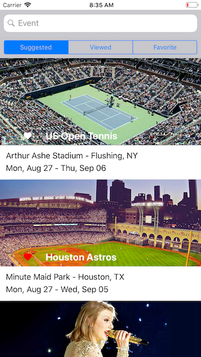

# BairesListDemoIOS-MVP
MVP Version

Demonstrates a UITableView implemented in MVP (Model View Presenter) pattern using Swift 4.

Every Cell clicked will be marked as viewed.

A click on the heart icon marks the Cell as favorite ( Red Heart ) or not favorite ( White Heart )

Every Scope will also be filtered by the text informed on the search bar.

## Setup
I just cloned this project!

## Localization
The project supports two idioms ( English / Portuguese )

Libraries
------------
Alamofire [version 4.7.3][1] for HTTP networking written in Swift. HTTP Methods, Parameter Encoding, HTTP Headers, Authentication.

SDWebImage [version 4.4.2][2] for Asynchronous image downloader with cache support.

[1]: https://github.com/Alamofire/Alamofire
[2]: https://github.com/rs/SDWebImage
